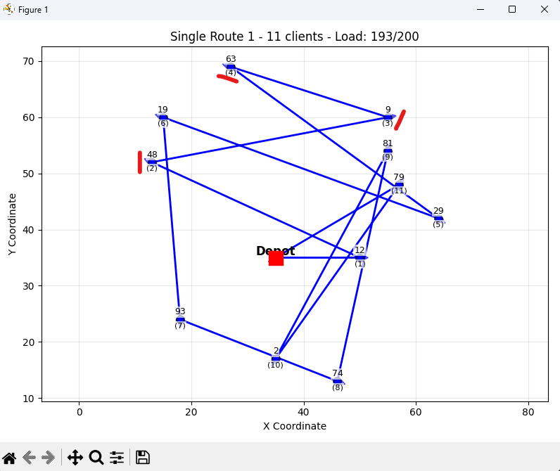
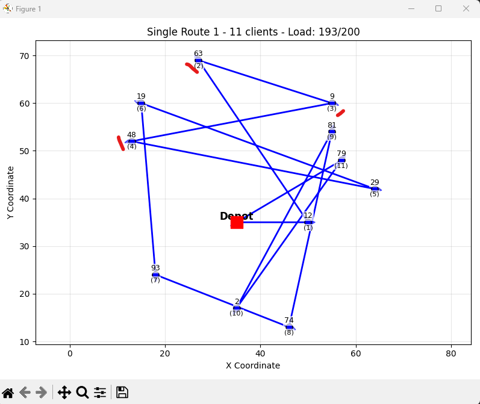

# tests des différentes transformations de voisinages

intra : se réfère à des transformations dans la même tournée de véhicule

inter : se réfère à des transformations entre les tournées de véhicules

# 2-opt

initialement : 48 -> 9 -> 63
après :        63 -> 9 -> 63